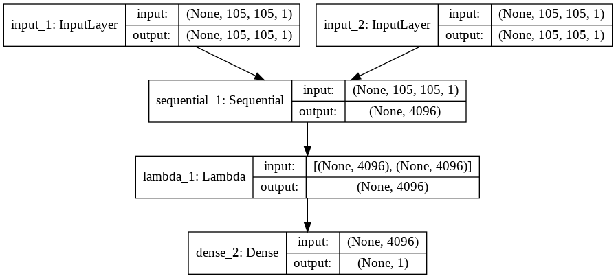

# Siamese Network

The following is a repository on the implementation of a siamese network on the omniglot dataset for image similarity estimation.

Siamese neural network is an artificial neural network that use the same weights while working in tandem on two different input vectors to compute comparable output vectors. Often one of the output vectors is precomputed, thus forming a baseline against which the other output vector is compared. This is similar to comparing fingerprints or more technical as a distance function for Locality-sensitive hashing.The one used in the notebook is shown as below.

DATASET--For the purpose of this blog, we will use the Omniglot dataset which is a collection of 1623 hand drawn characters from 50 different alphabets. For every character there are just 20 examples, each drawn by a different person. Each image is a gray scale image of resolution 105x105.

The work in the notebook is inspired from this [research paper](http://www.cs.utoronto.ca/~gkoch/files/msc-thesis.pdf) published by the Uiversity of Toronto on the very same dataset and this [blog on One Shot Learning and Siamese Networks in Keras](https://sorenbouma.github.io/blog/oneshot/) .The structure of the convolutional network layers is done by taking inferences from the same.